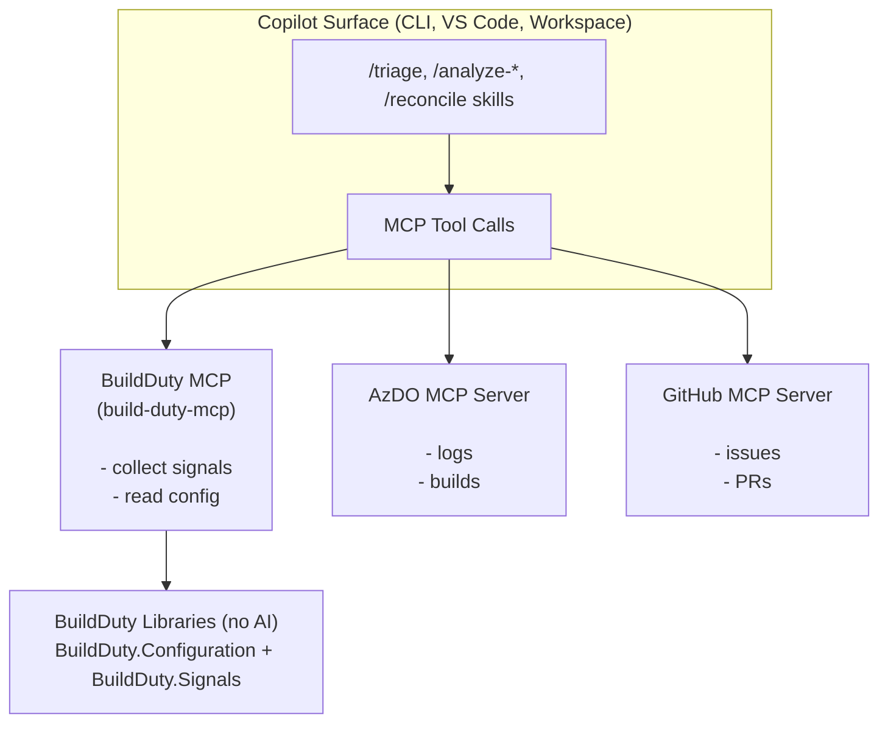

# BuildDuty

A .NET toolkit for build-duty workflows — collects signals from Azure DevOps
and GitHub, and provides Copilot skills and an MCP server for AI-powered triage.

## Architecture

BuildDuty is split into deterministic libraries (signal collection, config) and
AI integration (MCP server, Copilot skills):



## Quick start

### Prerequisites

- [.NET 10 SDK](https://dotnet.microsoft.com/) (see `global.json`)
- [Azure CLI](https://learn.microsoft.com/en-us/cli/azure/install-azure-cli) (`az`) — for Azure DevOps access
- [GitHub CLI](https://cli.github.com/) (`gh`) — for GitHub access

### Authenticate

```bash
az login
gh auth login
```

### Build and install

```bash
git clone https://github.com/ellahathaway/build-duty.git
cd build-duty

# Build, test, pack, and install the MCP server
./eng/build.sh --install

# Verify
build-duty-mcp --help
```

### Install the MCP server tool

The MCP server package (`ellahathaway.buildduty.mcp`) is hosted on GitHub Packages.
One-time setup:

```bash
# Ensure your GitHub CLI token has read:packages scope
gh auth refresh --scopes read:packages

# Add the GitHub Packages NuGet source (one-time)
dotnet nuget add source \
  --username YOUR_GITHUB_USERNAME \
  --password "$(gh auth token)" \
  --store-password-in-clear-text \
  --name github-ellahathaway \
  "https://nuget.pkg.github.com/ellahathaway/index.json"

# Install the MCP server tool globally
dotnet tool install --global ellahathaway.buildduty.mcp --version 0.0.1
```

> Marketplace plugins now run this setup automatically during `sessionStart`.
> Manual setup is still useful for standalone MCP usage.

## Usage

### Option 1: Copilot Marketplace (recommended)

Add the build-duty marketplace and install plugins:

```bash
# Add the marketplace
copilot plugin marketplace add ellahathaway/build-duty

# Install the triage plugin
copilot plugin install triage@build-duty
```

On first session start, the plugin auto-installs `BuildDuty.Mcp` if needed.
The setup hook checks:
- `gh` CLI version is 2.66.0+
- `gh auth` is logged in
- `az` is logged in
- GitHub Packages NuGet source is configured

Then you're ready to use the skills:

```
triage my pipelines
investigate the timeout in dotnet-source-build
```

Available plugins:

| Plugin | Description |
|--------|-------------|
| `triage` | Signal collection, pipeline/issue/PR analysis, and incident reconciliation |
| `reporting` | Triage summaries, incident timelines, and rotation handoff docs |
| `remediation` | Automated fixes for incidents (retry builds, etc.) |
| `config-management` | Managing `.build-duty.yml` configs |

Browse all available plugins with:

```bash
copilot plugin marketplace browse build-duty
```

### Option 2: MSBuild Task

Reference the `BuildDuty.Tasks` package for deterministic signal collection:

```xml
<Project>
  <UsingTask TaskName="BuildDuty.Tasks.CollectSignals"
             AssemblyFile="path/to/BuildDuty.Tasks.dll" />

  <Target Name="CollectBuildDutySignals">
    <CollectSignals ConfigPath=".build-duty.yml"
                    OutputPath="$(ArtifactsDir)/signals.xml" />
  </Target>
</Project>
```

### Option 3: MCP Server (standalone)

> **Prerequisite:** Install the MCP server tool first.
> See [Install the MCP server tool](#install-the-mcp-server-tool) above.

For standalone MCP server usage (e.g., custom clients or development), add the
following to your MCP client configuration:

```json
{
  "mcpServers": {
    "build-duty-mcp-server": {
      "command": "BuildDuty.Mcp"
    }
  }
}
```

If working in this repo, the MCP server is already configured in `.github/mcp.json`
and will be picked up automatically by GitHub Copilot.

Available tools:
- `build_duty_collect_signals` — collect signals from configured sources (requires `configPath`)
- `build_duty_get_config` — read and resolve a `.build-duty.yml` config

## Configuration

Create a `.build-duty.yml`:

```yaml
name: my-repo-monitor

azureDevOps:
  organizations:
    - url: https://dev.azure.com/dnceng
      projects:
        - name: internal
          pipelines:
            - id: 1234
              name: my-pipeline
              branches:
                - main

github:
  organizations:
    - name: dotnet
      repositories:
        - name: my-repo
          issues:
            - name: ".*"
              labels:
                - "Build Break"
              state: open
```

See the [configs/](configs/) directory for full examples.

### GitHub Issue and PR fields

Each entry under `issues` or `prs` is a pattern. All fields except `name` are optional.

| Field | Type | Description |
|---|---|---|
| `name` | regex | Title regex — only items whose title matches are included |
| `state` | `open` \| `closed` \| `all` | State filter (default: `open`) |
| `authors` | list | Allowlist of login names. Use `app/<name>` for GitHub Apps |
| `labels` | list | Include only items with **all** of these labels (AND) |
| `excludeLabels` | list | Exclude items with **any** of these labels (OR) |
| `context` | string | Free-text context injected into AI analysis prompts |

### Release branch auto-discovery

When a pipeline includes a `release` section, active .NET release branches are
automatically discovered from the [dotnet/core releases index](https://github.com/dotnet/core/blob/main/release-notes/releases-index.json).

## Building from source

### Linux / macOS

```bash
./eng/build.sh              # restore → build → test
./eng/build.sh --pack       # … + pack as NuGet
./eng/build.sh --install    # … + pack + install MCP server
```

### Windows

```powershell
.\eng\build.ps1              # restore → build → test
.\eng\build.ps1 -Pack        # … + pack as NuGet
.\eng\build.ps1 -Install     # … + pack + install MCP server
```

Or with the `dotnet` CLI directly:

```bash
dotnet restore BuildDuty.slnx
dotnet build   BuildDuty.slnx -c Release
dotnet test    BuildDuty.slnx -c Release
```

## Copilot Skills

Skills are in `.github/skills/` and available to anyone who clones the repo:

| Skill | Description |
|-------|-------------|
| `/triage` | Full workflow — collect, analyze, reconcile |
| `/analyze-azure-devops-pipeline` | Investigate a pipeline failure |
| `/analyze-github-issue` | Investigate a GitHub issue |
| `/analyze-github-pull-request` | Investigate a PR |
| `/reconcile-findings` | Group and deduplicate findings |
| `/review-work-items` | Deep-dive into specific incidents |

## Contributing

1. Fork and clone the repository.
2. Use `./eng/build.sh` (or `.\eng\build.ps1`) to build and test.
3. Open a pull request.
