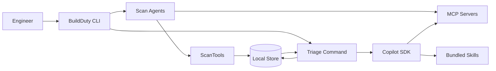
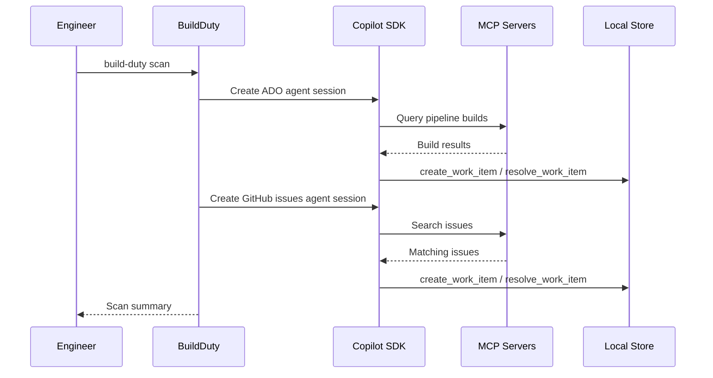

# BuildDuty — Design Document

## Contents
- [Background](#background)
- [Objective](#objective)
- [Design](#design)
- [Scope](#scope)
- [Architecture Overview](#architecture-overview)
- [Repository Layout](#repository-layout)
- [Configuration](#configuration)
- [CLI](#cli)
- [Signal Collection](#signal-collection)
- [Release Branch Discovery](#release-branch-discovery)
- [Work Item Lifecycle](#work-item-lifecycle)
- [Auto-Resolution](#auto-resolution)
- [AI Analysis](#ai-analysis)
- [Tool Distribution](#tool-distribution)
- [Storage and Persistence](#storage-and-persistence)
- [Contracts and Schemas](#contracts-and-schemas)
- [Security and Data Handling](#security-and-data-handling)
- [Testing](#testing)

## Background
Build duty for .NET repositories has historically required engineers to manually synthesize information from many disconnected sources. A representative example is the source-build monitor workflow, where build-duty engineers regularly check multiple Azure DevOps pipelines across different branches, respond to pings on GitHub issues and mentions, and keep an eye on pull requests in related repositories such as `source-build-externals` and `source-build-reference-packages`. Understanding the current state of the system requires hopping between pipeline views, GitHub searches, PR lists, and ad-hoc links shared in issues or chats.

Over time, this has resulted in ad-hoc scripts, bookmarks, and personal checklists that vary by engineer and repository. While existing dashboards and monitors provide valuable raw data, they do not offer a single, repeatable workflow for correlating failures, issues, PR activity, and historical context during an on-call or build-duty shift. BuildDuty formalizes this existing practice into a deterministic, repo-owned, CLI-based workflow that reflects how build duty is already performed today, while reducing cognitive overhead and improving consistency across repositories.

## Objective
BuildDuty is a .NET CLI tool that helps build-duty and on-call engineers quickly understand the current health of a repository and triage build and CI issues. It centralizes signal collection from Azure DevOps pipelines and GitHub issues/PRs into a single, repeatable workflow driven by repository-owned YAML configuration.

The tool uses AI-powered scanning through the GitHub Copilot SDK and MCP servers to collect and correlate signals, with bundled skills for triage and investigation. BuildDuty does not replace existing dashboards, monitoring systems, or ownership models, nor does it perform automatic remediation. It serves as a local, assistive tool that helps engineers form faster, better-informed judgments during build duty and incident response.

## Design
BuildDuty is a local, CLI-based workflow that standardizes how build-duty engineers collect and reason about build health across repositories. The core design centers on a repo-owned YAML configuration that explicitly declares which signals matter, ensuring the tool adapts to different .NET repository needs without hard-coded assumptions.

Signal collection uses AI agents through the GitHub Copilot SDK. Each source type (ADO pipelines, GitHub issues, GitHub PRs) runs as a separate AI session with MCP server access and write tools for work item management. AI agents follow the bundled `scan-signals` skill and its reference documentation to ensure consistent scanning behavior. Triage-specific skills provide summarization, root-cause analysis, clustering, and next-step recommendations.

## Scope

### In Scope
- AI-powered signal scanning from Azure DevOps pipelines and GitHub issues/PRs.
- Release branch auto-discovery from the dotnet/core releases index via bundled script.
- Work item creation and lifecycle tracking (`Unresolved`, `InProgress`, `Resolved`).
- Auto-resolution of work items when builds pass, release branches are superseded, or issues are closed.
- AI-assisted triage via GitHub Copilot SDK with bundled skills.
- MCP server integration (Azure DevOps, GitHub) for AI scanning and investigation.
- Local JSON-based storage scoped by config name.

### Out of Scope
- Automated remediation (rerunning pipelines, mutating repos, creating issues).
- Repository-defined custom skills or job routing.
- Replacing existing dashboards or becoming a source of truth.
- Long-term archival of full raw logs.

## Architecture Overview
BuildDuty is an AI-first CLI with clear boundaries between scanning, triage, and persistence.

Signal scanning uses AI agents powered by the GitHub Copilot SDK and MCP servers. Each source type (ADO pipelines, GitHub issues, GitHub PRs) runs as a separate AI session with the `scan-signals` skill. AI agents use tools (`ScanTools`) to create and resolve work items, and call a bundled Python script for release branch discovery.

AI triage uses the same Copilot SDK infrastructure with triage-specific skills (summarize, diagnose, cluster, suggest) and read-only data-access tools (`BuildDutyTools`).





## Repository Layout

```text
build-duty/
├─ BuildDuty.slnx
├─ .build-duty.yml
├─ .config/
│  └─ dotnet-tools.json
├─ src/
│  ├─ BuildDuty.Cli/
│  │  ├─ Commands/
│  │  │  ├─ ScanCommand.cs
│  │  │  ├─ WorkItemsCommand.cs
│  │  │  └─ TriageCommand.cs
│  │  ├─ Paths.cs
│  │  └─ Program.cs
│  ├─ BuildDuty.Core/
│  │  ├─ Models/
│  │  │  └─ BuildDutyConfig.cs
│  │  ├─ WorkItem.cs
│  │  └─ WorkItemStore.cs
│  ├─ BuildDuty.AI/
│  │  ├─ skills/
│  │  │  ├─ summarize/
│  │  │  ├─ diagnose-build-break/
│  │  │  ├─ cluster-incidents/
│  │  │  ├─ suggest-next-actions/
│  │  │  └─ scan-signals/
│  │  │     ├─ SKILL.md
│  │  │     ├─ references/
│  │  │     └─ scripts/
│  │  │        └─ resolve-release-branches.py
│  │  ├─ CopilotAdapter.cs
│  │  ├─ CopilotSessionFactory.cs
│  │  ├─ BuildDutyTools.cs       (shared read-only tools)
│  │  ├─ TriageTools.cs          (triage-only tools + skills)
│  │  ├─ ScanTools.cs            (scan-only tools + skills)
│  │  ├─ TriageResult.cs
│  │  ├─ TriageStore.cs
│  │  └─ ScanResult.cs
│  └─ BuildDuty.Tests/
├─ eng/
│  ├─ build.sh
│  └─ build.ps1
└─ docs/
   └─ design-doc.md
```

Notes:
- `BuildDuty.slnx` is the top-level solution file for local development and CI builds.
- `BuildDuty.Tests` contains unit tests organized by namespace.

## Configuration
Each repository declares the signals it cares about using a `.build-duty.yml` file. The `name` field is required and scopes all local storage to `~/.build-duty/<name>/`.

```yaml
name: sourcebuild-monitor

azureDevOps:
  organizations:
    - url: https://dev.azure.com/dnceng
      projects:
        - name: internal
          pipelines:
            - id: 1234
              name: dotnet-source-build
              branches:
                - main
              release:
                repository: dotnet-dotnet
                supportPhases: [active, maintenance, preview]
                minVersion: 8
              status: [failed, partiallySucceeded]

github:
  repositories:
    - owner: dotnet
      name: source-build
      issues:
        labels: ["Build Break"]
        state: open

ai:
  model: gpt-4o-mini
```

### Pipeline configuration
Each pipeline entry specifies:
- **`id`** — Azure DevOps pipeline definition ID.
- **`name`** — Display name for identification.
- **`branches`** — Static list of branches to monitor (optional).
- **`release`** — Enables auto-discovery of release branches (optional).
- **`status`** — Build outcomes that create work items (default: `failed`, `partiallySucceeded`).

The `branches` and `release` sections are additive. When `release` is present, discovered branches are merged with any statically listed branches.

### Release branch configuration
The `release` section enables automatic discovery of .NET release branches:
- **`repository`** — Azure DevOps Git repository name (default: `dotnet-dotnet`).
- **`supportPhases`** — Which .NET support phases to include (default: `active`, `maintenance`, `preview`, `go-live`, `rc`).
- **`minVersion`** — Minimum major version to consider (optional).

## CLI
BuildDuty exposes a small set of composable CLI commands for signal collection, work item inspection, and AI-assisted triage.

| Command | Purpose | Key Options | Output |
|---|---|---|---|
| `build-duty scan` | AI-assisted scanning for configured sources | `--config` | New/updated/resolved work items |
| `build-duty workitems list` | List tracked work items | `--state`, `--show-resolved`, `--limit` | Tabular list |
| `build-duty workitems show` | Inspect one work item | `--id` | Full detail and history |
| `build-duty triage` | AI-assisted triage | `--id`, `--action`, `--state`, `--show-resolved`, `--limit` | AI analysis result |

### Credential handling
BuildDuty authenticates using the GitHub Copilot SDK's default credential resolution. MCP servers handle their own authentication independently.

## Signal Collection
Signal collection uses AI agents powered by the GitHub Copilot SDK and MCP servers. The `build-duty scan` command spawns separate AI sessions for each configured source type, all using the `scan-signals` skill.

### Scanning Architecture
The `ScanCommand` reads `.build-duty.yml`, builds a prompt for each source type (ADO pipelines, GitHub issues, GitHub PRs), and creates a Copilot session for each. Sessions run in parallel and share access to the work item store via `ScanTools`.

Each AI agent:
1. Receives the source configuration as a YAML fragment in its prompt.
2. Consults the `scan-signals` skill and its reference docs for scanning procedures.
3. Uses MCP server tools to query the configured sources.
4. Calls `ScanTools` to create new work items and resolve existing ones.

### ScanTools
Write tools exposed to AI agents during scanning:
- **`create_work_item`** — Creates a new work item with ID, title, correlation ID, signal type, and signal reference URL. Skips duplicates.
- **`work_item_exists`** — Checks whether a work item ID is already tracked.
- **`resolve_work_item`** — Resolves a work item by transitioning it through `InProgress` → `Resolved` with a reason.
- **`list_work_items`** — Lists existing work items, optionally filtered by state.
- **`get_release_branches`** — Runs the bundled Python script to resolve active .NET release branches.

### ADO Pipeline Scanning
For each configured pipeline and branch combination:
1. The AI agent queries the Azure DevOps MCP server for the latest completed build.
2. If the build outcome matches the configured status filter, it creates a work item.
3. If the build succeeded, it checks for existing work items with the same correlation ID and resolves them.

Work item IDs follow the pattern `wi_ado_{buildId}`, and correlation IDs follow `corr_ado_{pipelineId}_{sanitizedBranch}`.

### GitHub Issue and PR Scanning
For each configured repository:
1. The AI agent queries the GitHub MCP server for issues/PRs matching configured labels and state.
2. It creates work items for matching items not already tracked.
3. It resolves work items for issues that have been closed or PRs that have been merged.

Issue IDs follow `wi_gh_issue_{owner}_{name}_{number}`, PR IDs follow `wi_gh_pr_{owner}_{name}_{number}`.

## Release Branch Discovery
When a pipeline has a `release` section, the scanning AI agent uses the `get_release_branches` tool to discover active branches. This tool runs a bundled Python script (`resolve-release-branches.py`) that:

1. **Downloads the releases index** from `https://raw.githubusercontent.com/dotnet/core/main/release-notes/releases-index.json`.
2. **Filters channels** to those matching configured support phases and minimum version.
3. **Downloads per-channel release data** to detect released SDK versions and shipped previews/RCs.
4. **Returns JSON** with supported channels, released SDK versions, and released preview identifiers.

The AI agent then uses MCP server tools to list repository branches, matches them against the supported channels, and filters stale branches:
- Removes branches for SDK versions that have already been released.
- Removes branches for previews/RCs that have already shipped.
- Keeps only the latest unreleased preview per major version.

This ensures monitoring focuses on branches that still require attention, without tracking branches for already-released or superseded versions.

## Work Item Lifecycle
Work items follow a strict state machine:

```
Unresolved ──→ InProgress ──→ Resolved
                   │
                   └──→ Unresolved (return on failure)
```

Valid transitions:
- `Unresolved → InProgress` — investigation started
- `InProgress → Resolved` — investigation completed
- `InProgress → Unresolved` — returned for further investigation

Invalid transitions throw `InvalidOperationException`. Every state change is recorded in the work item's `History` array with timestamp and actor metadata.

## Auto-Resolution
During scanning, AI agents automatically resolve work items that no longer need attention. A work item in `Unresolved` or `InProgress` state is resolved when:

1. **Latest build passes**: The AI agent finds the latest build for a pipeline/branch succeeds, and an existing work item tracks a failure for that same correlation ID. The agent calls `resolve_work_item` with reason: *"Auto-resolved: latest build succeeded"*.

2. **Branch superseded**: For pipelines with `release` config, the AI determines (via the release branch script and MCP server data) that a branch is no longer active. Work items tracking failures on that branch are resolved with reason: *"Auto-resolved: branch superseded by newer release"*.

3. **Issue/PR closed**: For GitHub-sourced work items, the AI resolves items when the underlying issue is closed or the PR is merged.

Auto-resolution transitions through valid states: if the item is `Unresolved`, the `resolve_work_item` tool moves it to `InProgress` first, then to `Resolved`.

## AI Analysis
BuildDuty provides AI-assisted triage through the GitHub Copilot SDK. The AI layer operates only on locally collected data and does not modify persisted signals.

### Architecture
- **`CopilotAdapter`** — Creates Copilot SDK sessions, sends prompts with context, and captures results. Supports both work-item-scoped triage (`TriageAsync`) and free-form scanning (`ScanSourceAsync`).
- **`CopilotSessionFactory`** — Configures sessions with MCP servers and tools. Each command specifies which skills to load.
- **`BuildDutyTools`** — Shared read-only tools (`get_work_item`, `list_work_items`, `work_item_exists`) available to all AI sessions.
- **`TriageTools`** — Triage-only tools (`get_signals`) and skills (`summarize`, `diagnose-build-break`, `cluster-incidents`, `suggest-next-actions`).
- **`ScanTools`** — Scan-only tools (`create_work_item`, `resolve_work_item`) and the `scan-signals` skill.

### Bundled skills
Skills are shipped with BuildDuty and loaded from the `skills/` directory relative to the tool's install location. Each skill directory contains a `SKILL.md` with YAML front-matter and markdown instructions, plus `references/` and `scripts/` subdirectories.

| Skill | Purpose |
|---|---|
| `summarize` | Summarize a work item with impact assessment and next steps |
| `diagnose-build-break` | Root-cause analysis with ranked likely causes |
| `cluster-incidents` | Group related failures by shared patterns |
| `suggest-next-actions` | Recommend concrete next steps for triage |
| `scan-signals` | AI-powered signal scanning with auto-resolution |

### MCP server integration
BuildDuty configures two MCP servers for AI sessions:

- **Azure DevOps** (local): `npx -y @mcp-apps/azure-devops-mcp-server` — enables the AI to query pipeline timelines, build logs, and test results.
- **GitHub** (remote): `https://api.githubcopilot.com/mcp/` — enables the AI to query issues, pull requests, and commits.

### AI execution flow
1. Engineer runs `build-duty triage --id wi_123 --action "summarize this failure"`.
2. BuildDuty loads the work item and transitions it to `InProgress`.
3. `CopilotAdapter` creates a session with triage skills and MCP servers.
4. The prompt includes work item details, signals, action text, and any prior run context.
5. Copilot SDK processes the request, optionally calling tools and MCP servers.
6. Result is persisted as a JSON file in `~/.build-duty/<name>/triage-runs/`.
7. Summary is rendered to the terminal.

### Batch mode
When `--id` is omitted, BuildDuty enters batch mode:
1. Load work items matching `--state` and `--show-resolved` filters.
2. Present an interactive multi-select prompt.
3. Process selected items in parallel, each getting its own AI session.

## Tool Distribution
BuildDuty is distributed as a .NET CLI tool. Repositories opt in by adding it to their `.config/dotnet-tools.json` manifest or installing it globally.

### Build scripts
The `eng/` directory contains build scripts:
- `eng/build.sh` (Linux/macOS) — restore, build, test; `--pack` for NuGet packaging.
- `eng/build.ps1` (Windows) — same workflow; `-Pack` flag for packaging.

## Storage and Persistence
BuildDuty persists work items and AI results as JSON files under `~/.build-duty/<name>/`, where `<name>` is the required `name` field from `.build-duty.yml`.

```
~/.build-duty/
└── sourcebuild-monitor/
    ├── workitems/          # {workItemId}.json
    └── triage-runs/        # {triageRunId}.json
```

Work item files contain the full work item record including signals and history. AI run files contain execution metadata, the action performed, and the AI's response.

## Contracts and Schemas

### Work Item Schema
```json
{
  "id": "wi_ado_12345",
  "state": "unresolved",
  "title": "[Source Build] main — Build #20260319.13 failed",
  "correlationId": "corr_ado_1234_main",
  "signals": [
    {
      "type": "ado-pipeline-run",
      "ref": "https://dev.azure.com/dnceng/internal/_build/results?buildId=12345"
    }
  ],
  "history": [
    {
      "timestampUtc": "2026-03-19T12:34:56Z",
      "action": "state-change",
      "from": "unresolved",
      "to": "inprogress",
      "actor": "build-duty"
    }
  ]
}
```

### Triage Run Result Schema
```json
{
  "runId": "triage_abc123",
  "workItemId": "wi_ado_12345",
  "action": "summarize this failure",
  "success": true,
  "summary": "Build failure caused by regression in PR #567...",
  "startedUtc": "2026-03-19T12:35:00Z",
  "finishedUtc": "2026-03-19T12:35:08Z"
}
```

## Security and Data Handling
- Only required configuration and context are sent to AI sessions.
- Secrets and tokens are never written to persisted artifacts.
- Credentials are resolved at runtime via `gh auth token` or environment variables.
- MCP servers handle their own authentication independently.
- AI output is stored alongside — but never replaces — raw work item data.

## Testing
Tests are organized in `BuildDuty.Tests` using xUnit:

| Test File | Coverage |
|---|---|
| `BuildDutyConfigTests` | YAML parsing, name validation, pipeline config |
| `ScanToolsTests` | Work item CRUD tools, dedup, state transitions, release branches |
| `WorkItemStateTransitionTests` | Valid/invalid transitions, history tracking |
| `WorkItemStoreTests` | JSON round-trip, filtering, listing |
