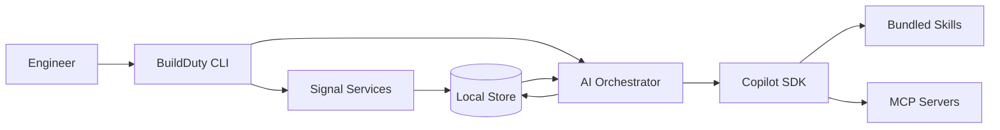
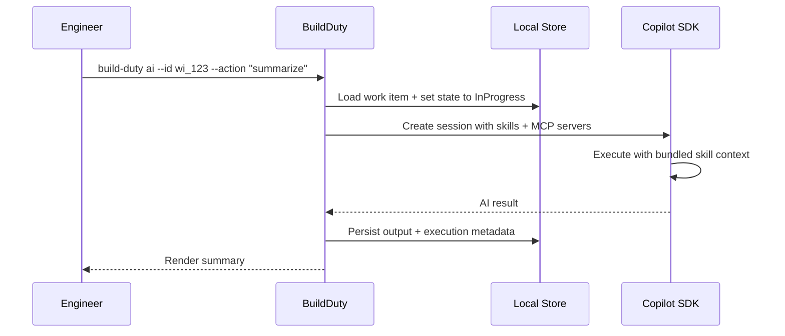

# BuildDuty — Design Document

## Contents
- [Background](#background)
- [Objective](#objective)
- [Design](#design)
- [Scope](#scope)
- [Architecture Overview](#architecture-overview)
- [Repository Layout](#repository-layout)
- [Configuration](#configuration)
- [CLI](#cli)
- [Signal Collection](#signal-collection)
- [Release Branch Discovery](#release-branch-discovery)
- [Work Item Lifecycle](#work-item-lifecycle)
- [Auto-Resolution](#auto-resolution)
- [AI Analysis](#ai-analysis)
- [Tool Distribution](#tool-distribution)
- [Storage and Persistence](#storage-and-persistence)
- [Contracts and Schemas](#contracts-and-schemas)
- [Security and Data Handling](#security-and-data-handling)
- [Testing](#testing)

## Background
Build duty for .NET repositories has historically required engineers to manually synthesize information from many disconnected sources. A representative example is the source-build monitor workflow, where build-duty engineers regularly check multiple Azure DevOps pipelines across different branches, respond to pings on GitHub issues and mentions, and keep an eye on pull requests in related repositories such as `source-build-externals` and `source-build-reference-packages`. Understanding the current state of the system requires hopping between pipeline views, GitHub searches, PR lists, and ad-hoc links shared in issues or chats.

Over time, this has resulted in ad-hoc scripts, bookmarks, and personal checklists that vary by engineer and repository. While existing dashboards and monitors provide valuable raw data, they do not offer a single, repeatable workflow for correlating failures, issues, PR activity, and historical context during an on-call or build-duty shift. BuildDuty formalizes this existing practice into a deterministic, repo-owned, CLI-based workflow that reflects how build duty is already performed today, while reducing cognitive overhead and improving consistency across repositories.

## Objective
BuildDuty is a .NET CLI tool that helps build-duty and on-call engineers quickly understand the current health of a repository and triage build and CI issues. It centralizes signal collection from Azure DevOps pipelines and GitHub issues/PRs into a single, repeatable workflow driven by repository-owned YAML configuration.

The tool provides deterministic, auditable collection and correlation of relevant signals, with optional AI-assisted summarization to accelerate investigation and decision-making. BuildDuty does not replace existing dashboards, monitoring systems, or ownership models, nor does it perform automatic remediation. It serves as a local, assistive tool that helps engineers form faster, better-informed judgments during build duty and incident response.

## Design
BuildDuty is a local, CLI-based workflow that standardizes how build-duty engineers collect and reason about build health across repositories. The core design centers on a repo-owned YAML configuration that explicitly declares which signals matter, ensuring the tool adapts to different .NET repository needs without hard-coded assumptions.

Signal collection and correlation are deterministic and auditable, producing repeatable results from the same inputs and configuration. Optional AI assistance is layered on top of this deterministic core through the GitHub Copilot SDK with bundled skills and MCP server integration. AI output does not replace or modify collected signals, allowing engineers to clearly distinguish between raw data and assistive analysis.

## Scope

### In Scope
- Deterministic signal collection from Azure DevOps pipelines and GitHub issues/PRs.
- Release branch auto-discovery from the dotnet/core releases index.
- Work item creation and lifecycle tracking (`Unresolved`, `InProgress`, `Resolved`).
- Auto-resolution of work items when builds pass or release branches are superseded.
- AI-assisted triage via GitHub Copilot SDK with bundled skills.
- MCP server integration (Azure DevOps, GitHub) for deep AI investigation.
- Local JSON-based storage scoped by config name.

### Out of Scope
- Automated remediation (rerunning pipelines, mutating repos, creating issues).
- Repository-defined custom skills or job routing.
- Replacing existing dashboards or becoming a source of truth.
- Long-term archival of full raw logs.

## Architecture Overview
BuildDuty is an orchestration-first CLI with clear boundaries between collection, correlation, AI execution, and persistence.

Signal collection uses a shared interface (`ISignalService`) with two implementations: `AzureDevOpsSignalService` for pipeline runs and `GitHubSignalService` for issues and pull requests. Services are composed via dependency injection and executed by the scan workflow.





## Repository Layout

```text
build-duty/
├─ BuildDuty.slnx
├─ .build-duty.yml
├─ .config/
│  └─ dotnet-tools.json
├─ src/
│  ├─ BuildDuty.Cli/
│  │  ├─ Commands/
│  │  │  ├─ ScanCommand.cs
│  │  │  ├─ WorkItemsCommand.cs
│  │  │  └─ AiCommand.cs
│  │  ├─ Paths.cs
│  │  └─ Program.cs
│  ├─ BuildDuty.Core/
│  │  ├─ Models/
│  │  │  └─ BuildDutyConfig.cs
│  │  ├─ AzureDevOpsSignalService.cs
│  │  ├─ GitHubSignalService.cs
│  │  ├─ ReleaseBranchResolver.cs
│  │  ├─ WorkItem.cs
│  │  └─ WorkItemStore.cs
│  ├─ BuildDuty.AI/
│  │  ├─ skills/
│  │  │  ├─ summarize/
│  │  │  ├─ diagnose-build-break/
│  │  │  ├─ cluster-incidents/
│  │  │  └─ suggest-next-actions/
│  │  ├─ CopilotAdapter.cs
│  │  ├─ CopilotSessionFactory.cs
│  │  ├─ AiOrchestrator.cs
│  │  └─ AiRunStore.cs
│  └─ BuildDuty.Tests/
├─ eng/
│  ├─ build.sh
│  └─ build.ps1
└─ docs/
   └─ design-doc.md
```

Notes:
- `BuildDuty.slnx` is the top-level solution file for local development and CI builds.
- `BuildDuty.Tests` contains unit tests organized by namespace.

## Configuration
Each repository declares the signals it cares about using a `.build-duty.yml` file. The `name` field is required and scopes all local storage to `~/.build-duty/<name>/`.

```yaml
name: sourcebuild-monitor

azureDevOps:
  organizations:
    - url: https://dev.azure.com/dnceng
      projects:
        - name: internal
          pipelines:
            - id: 1234
              name: dotnet-source-build
              branches:
                - main
              release:
                repository: dotnet-dotnet
                supportPhases: [active, maintenance, preview]
                minVersion: 8
              status: [failed, partiallySucceeded]

github:
  repositories:
    - owner: dotnet
      name: source-build
      issues:
        labels: ["Build Break"]
        state: open

ai:
  model: gpt-4o-mini
```

### Pipeline configuration
Each pipeline entry specifies:
- **`id`** — Azure DevOps pipeline definition ID.
- **`name`** — Display name for identification.
- **`branches`** — Static list of branches to monitor (optional).
- **`release`** — Enables auto-discovery of release branches (optional).
- **`status`** — Build outcomes that create work items (default: `failed`, `partiallySucceeded`).

The `branches` and `release` sections are additive. When `release` is present, discovered branches are merged with any statically listed branches.

### Release branch configuration
The `release` section enables automatic discovery of .NET release branches:
- **`repository`** — Azure DevOps Git repository name (default: `dotnet-dotnet`).
- **`supportPhases`** — Which .NET support phases to include (default: `active`, `maintenance`, `preview`, `go-live`, `rc`).
- **`minVersion`** — Minimum major version to consider (optional).

## CLI
BuildDuty exposes a small set of composable CLI commands for signal collection, work item inspection, and AI-assisted triage.

| Command | Purpose | Key Options | Output |
|---|---|---|---|
| `build-duty scan` | Collect signals, create/resolve work items | `--ci`, `--config` | New/updated/resolved work items |
| `build-duty workitems list` | List tracked work items | `--state`, `--show-resolved`, `--limit` | Tabular list |
| `build-duty workitems show` | Inspect one work item | `--id` | Full detail and history |
| `build-duty ai` | AI-assisted triage | `--id`, `--action`, `--state`, `--show-resolved`, `--limit` | AI analysis result |

### Credential handling
BuildDuty supports two authentication modes:

- **Interactive** (default): Uses `ChainedTokenCredential` with Azure CLI and interactive browser for Azure DevOps, and `gh auth token` or `GITHUB_TOKEN` for GitHub.
- **CI mode** (`--ci`): Reads `SYSTEM_ACCESSTOKEN` or `AZURE_DEVOPS_PAT` environment variables for Azure DevOps, and `GITHUB_TOKEN` for GitHub.

## Signal Collection
Signal collection is the deterministic core of BuildDuty. Each `ISignalService` implementation collects signals from a configured source and returns work items.

### Azure DevOps Signal Service
For each configured pipeline and branch combination:
1. Fetch the latest completed build for that branch.
2. If the build outcome matches the configured status filter, create a work item.
3. Track the correlation ID (`corr_ado_{pipelineId}_{branch}`) for auto-resolution.
4. If the latest build passes, record its correlation ID in `PassingCorrelationIds`.

Work item IDs follow the pattern `wi_ado_{buildId}`, ensuring each build failure maps to exactly one work item.

### GitHub Signal Service
For each configured repository:
1. Query issues matching configured labels and state.
2. Query pull requests matching configured labels and state (if configured).
3. Create work items with IDs following `wi_gh_issue_{owner}_{name}_{number}` or `wi_gh_pr_{owner}_{name}_{number}`.

## Release Branch Discovery
When a pipeline has a `release` section, `ReleaseBranchResolver` automatically discovers which release branches to monitor:

1. **Fetch branches** from the configured Azure DevOps Git repository.
2. **Download the releases index** from `https://raw.githubusercontent.com/dotnet/core/main/release-notes/releases-index.json`.
3. **Filter channels** to those matching configured support phases and minimum version.
4. **Download per-channel release data** to detect released SDK versions and shipped previews/RCs.
5. **Categorize branches** by version label (main, feature-band, specific-version, preview/RC).
6. **Filter stale branches**:
   - Remove specific-version branches when a higher SDK version has been released in the same feature band.
   - Remove preview/RC branches when that preview/RC has already shipped.
   - Keep only the latest unreleased preview per major version.

This ensures monitoring focuses on branches that still require attention, without tracking branches for already-released or superseded versions.

## Work Item Lifecycle
Work items follow a strict state machine:

```
Unresolved ──→ InProgress ──→ Resolved
                   │
                   └──→ Unresolved (return on failure)
```

Valid transitions:
- `Unresolved → InProgress` — investigation started
- `InProgress → Resolved` — investigation completed
- `InProgress → Unresolved` — returned for further investigation

Invalid transitions throw `InvalidOperationException`. Every state change is recorded in the work item's `History` array with timestamp and actor metadata.

## Auto-Resolution
During scanning, BuildDuty automatically resolves work items that no longer need attention. A work item in `Unresolved` or `InProgress` state is resolved if:

1. **Latest build passes**: The work item's correlation ID appears in `PassingCorrelationIds`, meaning the latest build for that pipeline/branch now succeeds. Resolution reason: *"Auto-resolved: latest build succeeded"*.

2. **Branch superseded**: For pipelines with `release` config, the work item's correlation ID matches a release pipeline prefix but is no longer in the set of active branches (i.e., the branch has been superseded by a newer release). Resolution reason: *"Auto-resolved: branch superseded by newer release"*.

Auto-resolution transitions through valid states: if the item is `Unresolved`, it moves to `InProgress` first, then to `Resolved`.

## AI Analysis
BuildDuty provides AI-assisted triage through the GitHub Copilot SDK. The AI layer operates only on locally collected data and does not modify persisted signals.

### Architecture
- **`CopilotAdapter`** — Creates a Copilot SDK client and session, sends prompts with work item context, and captures results.
- **`CopilotSessionFactory`** — Configures sessions with bundled skills, MCP servers, and data-access tools.
- **`AiOrchestrator`** — Manages work item state transitions around AI execution, invokes the adapter, and persists results.
- **`BuildDutyTools`** — Exposes `get_work_item`, `list_work_items`, and `get_signals` as tools for the AI to call during analysis.

### Bundled skills
Skills are shipped with BuildDuty and loaded from the `skills/` directory relative to the tool's install location. Each skill directory contains a `SKILL.md` with YAML front-matter and markdown instructions, plus `references/` and `scripts/` subdirectories.

| Skill | Purpose |
|---|---|
| `summarize` | Summarize a work item with impact assessment and next steps |
| `diagnose-build-break` | Root-cause analysis with ranked likely causes |
| `cluster-incidents` | Group related failures by shared patterns |
| `suggest-next-actions` | Recommend concrete next steps for triage |

### MCP server integration
BuildDuty configures two MCP servers for AI sessions:

- **Azure DevOps** (local): `npx -y @mcp-apps/azure-devops-mcp-server` — enables the AI to query pipeline timelines, build logs, and test results.
- **GitHub** (remote): `https://api.githubcopilot.com/mcp/` — enables the AI to query issues, pull requests, and commits.

### AI execution flow
1. Engineer runs `build-duty ai --id wi_123 --action "summarize this failure"`.
2. BuildDuty loads the work item and transitions it to `InProgress`.
3. `CopilotAdapter` creates a session with all bundled skills and MCP servers.
4. The prompt includes work item details, signals, action text, and any prior AI run context.
5. Copilot SDK processes the request, optionally calling tools and MCP servers.
6. Result is persisted as a JSON file in `~/.build-duty/<name>/ai-runs/`.
7. Summary is rendered to the terminal.

### Batch mode
When `--id` is omitted, BuildDuty enters batch mode:
1. Load work items matching `--state` and `--show-resolved` filters.
2. Present an interactive multi-select prompt.
3. Process selected items in parallel via `AiOrchestrator`.

## Tool Distribution
BuildDuty is distributed as a .NET CLI tool. Repositories opt in by adding it to their `.config/dotnet-tools.json` manifest or installing it globally.

### Build scripts
The `eng/` directory contains build scripts:
- `eng/build.sh` (Linux/macOS) — restore, build, test; `--pack` for NuGet packaging.
- `eng/build.ps1` (Windows) — same workflow; `-Pack` flag for packaging.

## Storage and Persistence
BuildDuty persists work items and AI results as JSON files under `~/.build-duty/<name>/`, where `<name>` is the required `name` field from `.build-duty.yml`.

```
~/.build-duty/
└── sourcebuild-monitor/
    ├── workitems/          # {workItemId}.json
    └── ai-runs/            # {aiRunId}.json
```

Work item files contain the full work item record including signals and history. AI run files contain execution metadata, the action performed, and the AI's response.

## Contracts and Schemas

### Work Item Schema
```json
{
  "id": "wi_ado_12345",
  "state": "unresolved",
  "title": "[Source Build] main — Build #20260319.13 failed",
  "correlationId": "corr_ado_1234_main",
  "signals": [
    {
      "type": "ado-pipeline-run",
      "ref": "https://dev.azure.com/dnceng/internal/_build/results?buildId=12345"
    }
  ],
  "history": [
    {
      "timestampUtc": "2026-03-19T12:34:56Z",
      "action": "state-change",
      "from": "unresolved",
      "to": "inprogress",
      "actor": "build-duty"
    }
  ]
}
```

### AI Run Result Schema
```json
{
  "runId": "airun_abc123",
  "workItemId": "wi_ado_12345",
  "action": "summarize this failure",
  "startedUtc": "2026-03-19T12:35:00Z",
  "finishedUtc": "2026-03-19T12:35:08Z",
  "exitCode": 0,
  "summary": "Build failure caused by regression in PR #567..."
}
```

## Security and Data Handling
- Only required fields are sent to AI execution.
- Secrets and tokens are never written to persisted artifacts.
- Credentials are resolved at runtime via Azure.Identity or environment variables.
- AI output is stored alongside — but never replaces — raw collected signals.

## Testing
Tests are organized in `BuildDuty.Tests` using xUnit:

| Test File | Coverage |
|---|---|
| `AzureDevOpsSignalServiceTests` | Service initialization, status defaults, URL parsing |
| `BuildDutyConfigTests` | YAML parsing, name validation, pipeline config |
| `GitHubSignalServiceTests` | Config defaults, empty repos, credential provider |
| `ReleaseBranchResolverTests` | Branch categorization, filtering, preview/RC logic |
| `WorkItemStateTransitionTests` | Valid/invalid transitions, history tracking |
| `WorkItemStoreTests` | JSON round-trip, filtering, listing |
